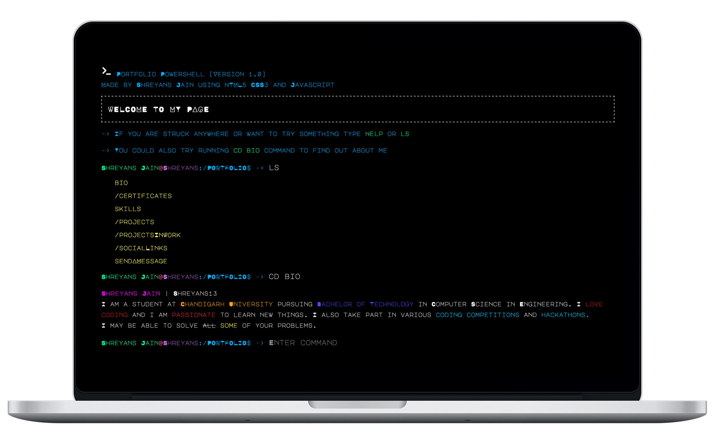
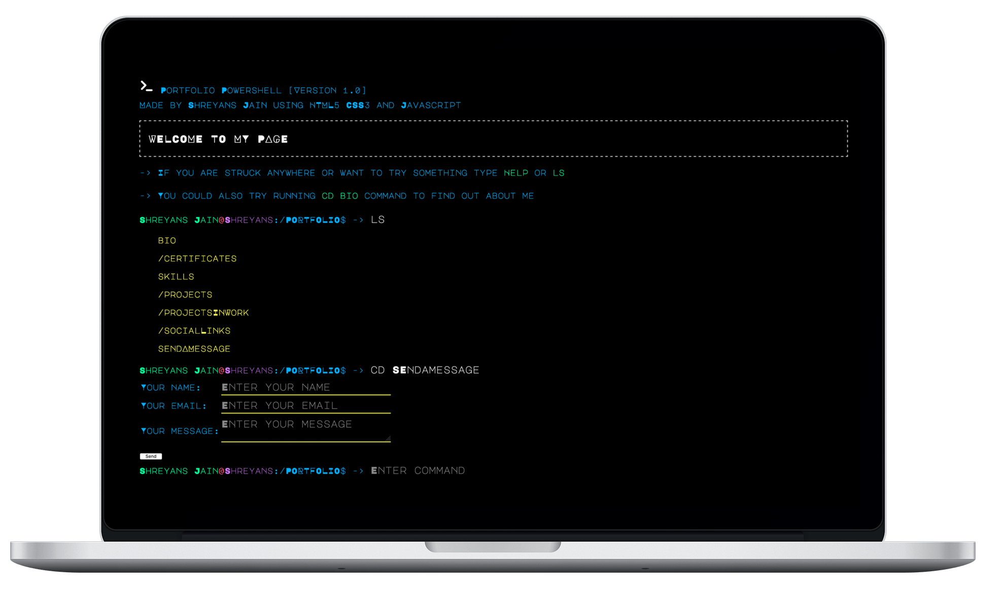

# CLI-Portfolio

## How to use

In the portfolio powershell

```
type HELP to view all the commands
type LS to view the directories
```

## Screenshots

### Desktop

 
 
 

## Deployment

### [CLI-Portfolio](https://shreyans13.github.io/CLI-Portfolio/index.html)
